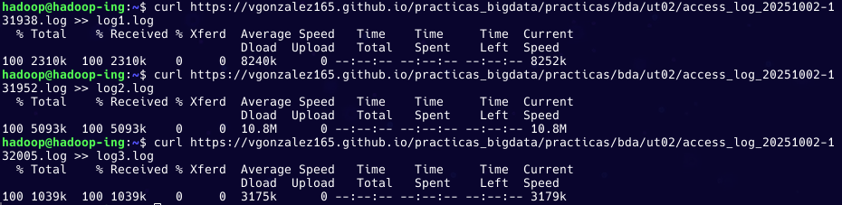
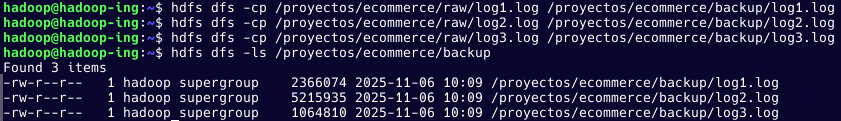

# PR0203: Uso del cliente HDSF (2)

## `1. Preparación del espacio de trabajo en HDFS`

## `2. Carga inicial de logs`

## `3. Inspección de datos`

## `4. Organización de los logs`

## `5. Acceso compartido para analistas`

## `6. Simulación de trabajo con analistas`

## `7. Mantenimiento y limpieza`

