# PR0602. AWS Lambda
## Ejercicio 1
### Código de la función
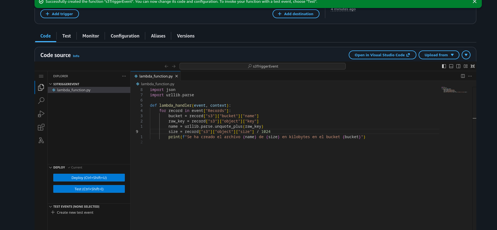
### Configuración trigger
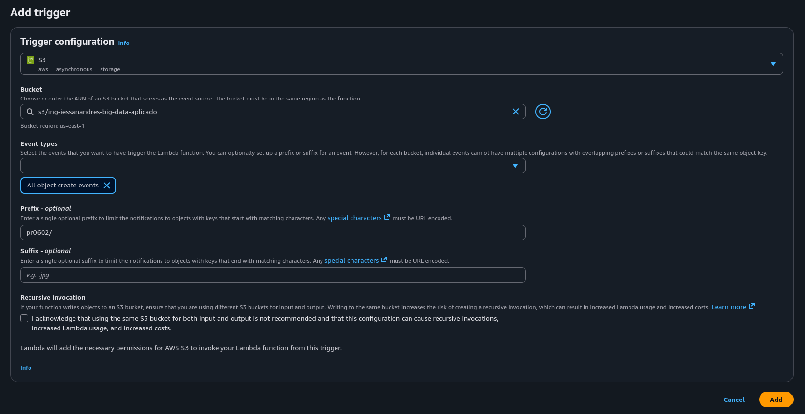
### Archivo subido
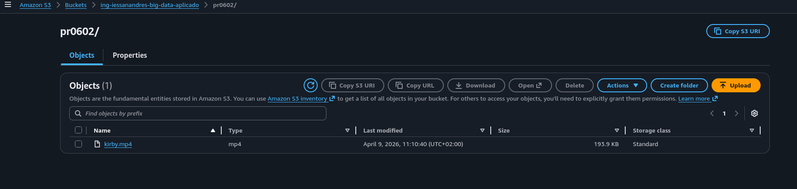
### Resultado logs
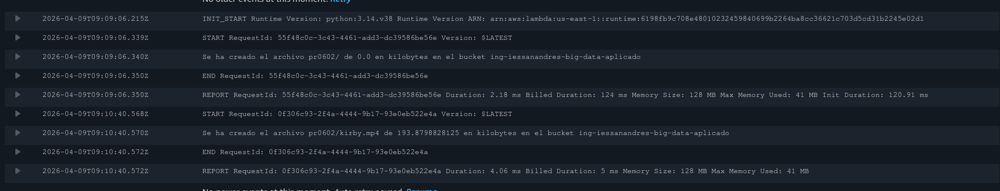
## Ejercicio 2
### Resultado logs
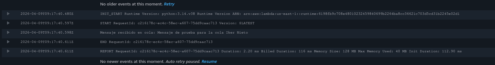
## Ejercicio 3
### Resultado
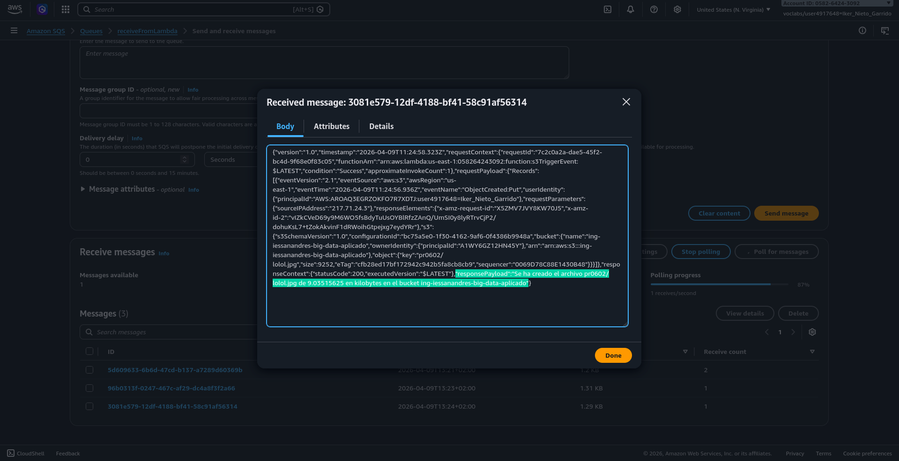
## Ejercicio 4
### Resultado
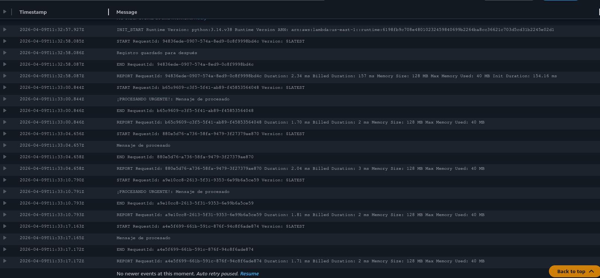
## Ejercicio 5
### Código 
```python
from dotenv import load_dotenv
import boto3
import json
import os

load_dotenv()
session = boto3.Session(
        aws_access_key_id=os.getenv("aws_access_key_id"),
        aws_secret_access_key=os.getenv("aws_secret_access_key"),
        aws_session_token=os.getenv("aws_session_token"),
        region_name='us-east-1'
    )
sqs = session.client('sqs')

queue_url = 'MiBuzon'

datos_archivo = {
        "prioridad": "ALTA",
        "mensaje": "Mensaje de procesamiento, desde el script"
}

mensaje_serializado = json.dumps(datos_archivo)

response = sqs.send_message(
    QueueUrl=queue_url,
    MessageBody=mensaje_serializado
)
print("Respuesta prioridad alta:", response)


datos_archivo = {
        "prioridad": "BAJA",
        "mensaje": "Mensaje de procesamiento, desde el script"
}

mensaje_serializado = json.dumps(datos_archivo)

response = sqs.send_message(
    QueueUrl=queue_url,
    MessageBody=mensaje_serializado
)

print("Respuesta prioridad baja:", response)
datos_archivo = {
        "prioridad": "MEDIA",
        "mensaje": "Mensaje de procesamiento, desde el script"
}

mensaje_serializado = json.dumps(datos_archivo)

response = sqs.send_message(
    QueueUrl=queue_url,
    MessageBody=mensaje_serializado
)

print("Respuesta prioridad media:", response)
```
Respuesta:  
```bash
Respuesta prioridad alta: {'MD5OfMessageBody': 'ce737b06f59c713aa05153da51fb2a3f', 'MessageId': 'dea980d9-f90d-4305-9b23-151df8f4ad0e', 'ResponseMetadata': {'RequestId': 'f9faa769-eda2-534c-82d3-c5387198f104', 'HTTPStatusCode': 200, 'HTTPHeaders': {'x-amzn-requestid': 'f9faa769-eda2-534c-82d3-c5387198f104', 'date': 'Thu, 09 Apr 2026 12:22:18 GMT', 'content-type': 'application/x-amz-json-1.0', 'content-length': '106', 'connection': 'keep-alive'}, 'RetryAttempts': 0}}
Respuesta prioridad baja: {'MD5OfMessageBody': '41f2039b5063ca75134f4b71dacdc954', 'MessageId': '6fc0526a-c2bc-4590-bd6b-bb5f8d7ad072', 'ResponseMetadata': {'RequestId': '35000640-c9ae-5673-8fdd-64115594843b', 'HTTPStatusCode': 200, 'HTTPHeaders': {'x-amzn-requestid': '35000640-c9ae-5673-8fdd-64115594843b', 'date': 'Thu, 09 Apr 2026 12:22:18 GMT', 'content-type': 'application/x-amz-json-1.0', 'content-length': '106', 'connection': 'keep-alive'}, 'RetryAttempts': 0}}
Respuesta prioridad media: {'MD5OfMessageBody': '1cd4b601898395bb7a2bf80170c50b01', 'MessageId': '6cd7a6ab-4830-4218-9f9b-93dc84c4f437', 'ResponseMetadata': {'RequestId': '9ac8e9ba-af1a-50f5-8b96-8beb3320e2bd', 'HTTPStatusCode': 200, 'HTTPHeaders': {'x-amzn-requestid': '9ac8e9ba-af1a-50f5-8b96-8beb3320e2bd', 'date': 'Thu, 09 Apr 2026 12:22:18 GMT', 'content-type': 'application/x-amz-json-1.0', 'content-length': '106', 'connection': 'keep-alive'}, 'RetryAttempts': 0}}
```
### Resultado
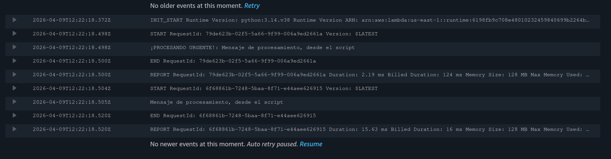
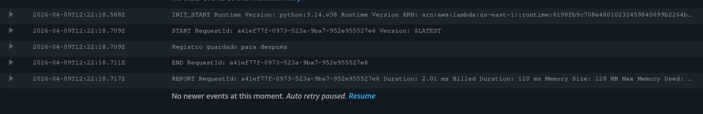
## Ejercicio 6
### Configuración de la regla
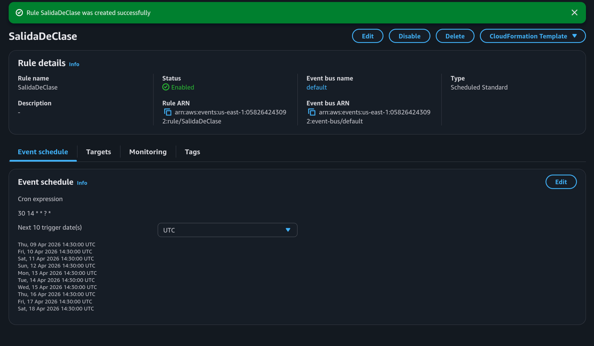
### Resultado
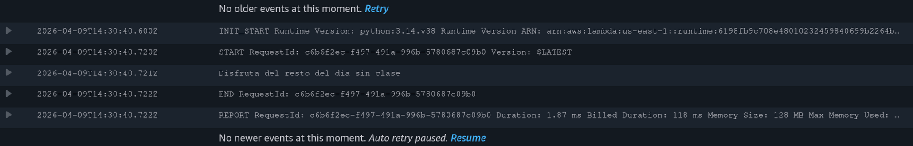
## Ejercicio 7
### Resultado
> Aparecen más logs. Los importantes son los últimos. Se imprime también el payload para asegurar que se ejecutó desde _EventBridge_  

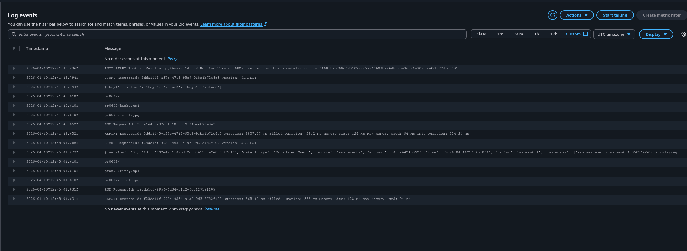
## Ejercicio 8
### Cola SQS creada
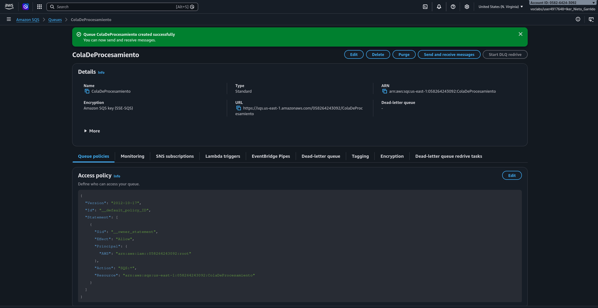
### Archivo subido a S3
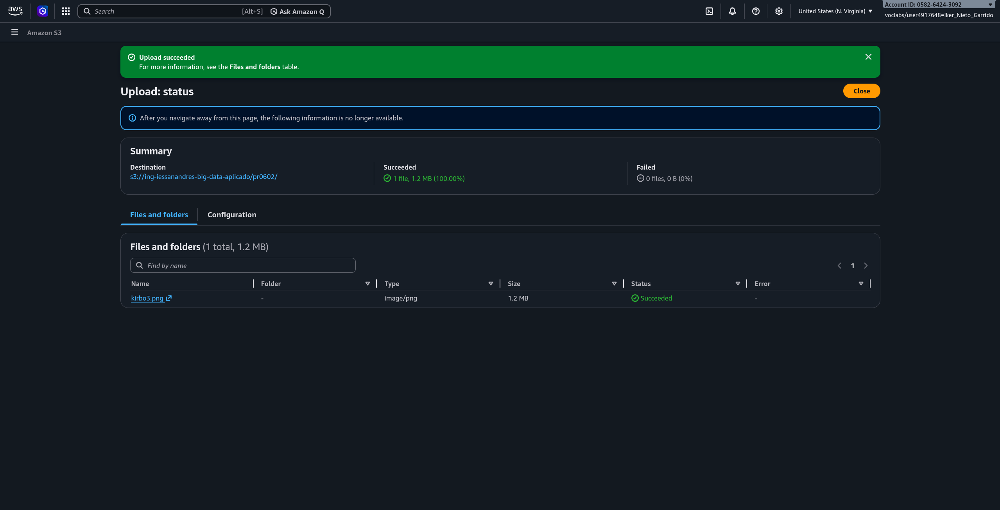
### Resultado
> Se puede ver el resultado producido por la lambda en el final del mensaje recibido  

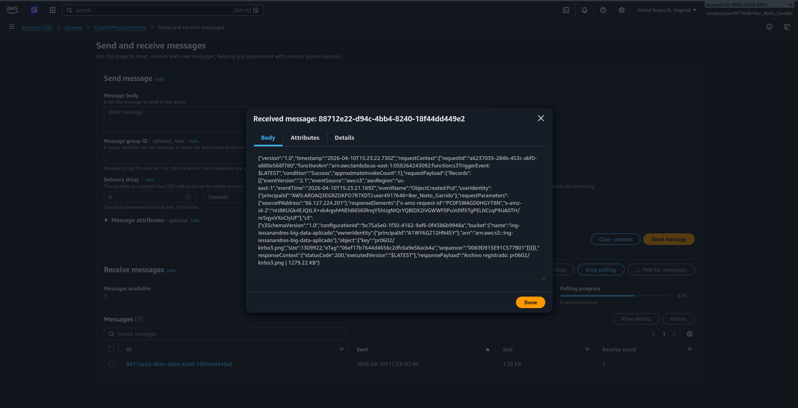